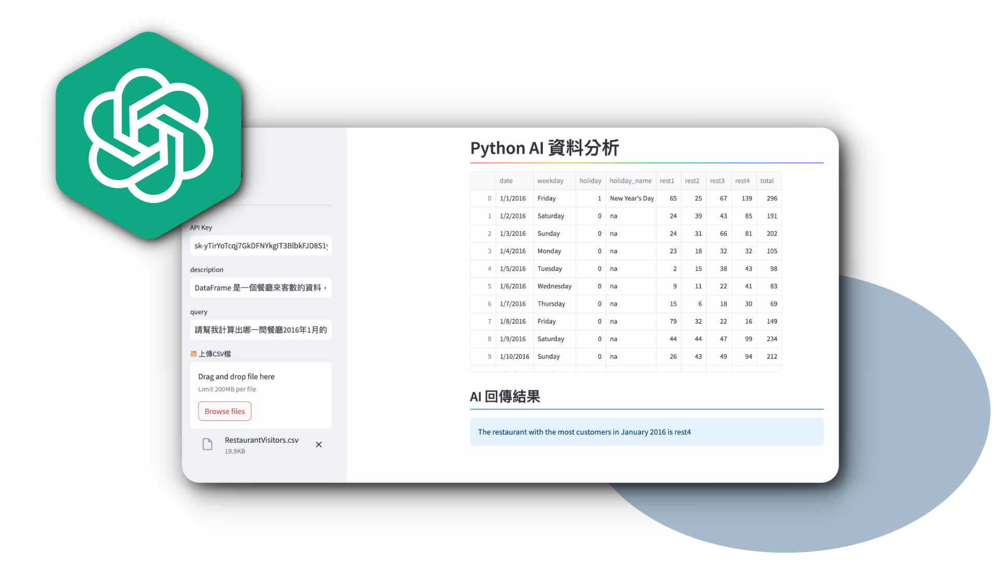

# Python AI 資料分析【Code Gym】
*使用Python 整合OpenAI 模型，用自然語言與資料對話*

Pandas-AI 是一個將人工智慧與Pandas 結合的模組，我們可以透過簡單的自然語言，與資料進行對話，並且畫出圖表，它可以幫助我們用更直觀的方式操作Pandas，它還可以結合AI 的輔助，修正我們下的提示語或問題，幫助我們能夠獲得更精準的答案，當我們取得分析結果後，還可以與AI 討論它分析的過程，理解AI 的分析問題的思路，當我們有多筆資料時，Pandas-AI 也能夠合併多個資料來源，執行更複雜的深度分析，如果你想進一步學習結合AI 分析資料，可以參考我的Python AI 資料分析課程，這堂課程還會示範如何應用AI，進行股票投資分析，輔助你判斷進場的時機，最後會教你製作一個有介面的AI 資料分析系統，你可以直接透過瀏覽器操作AI 系統，這些教學我都放在Python AI 資料分析課程當中，你可以前往Code Gym 的官網了解課程章節

[Python AI 資料分析課程網址](https://www.codegym.tech/python-data-analysis)

